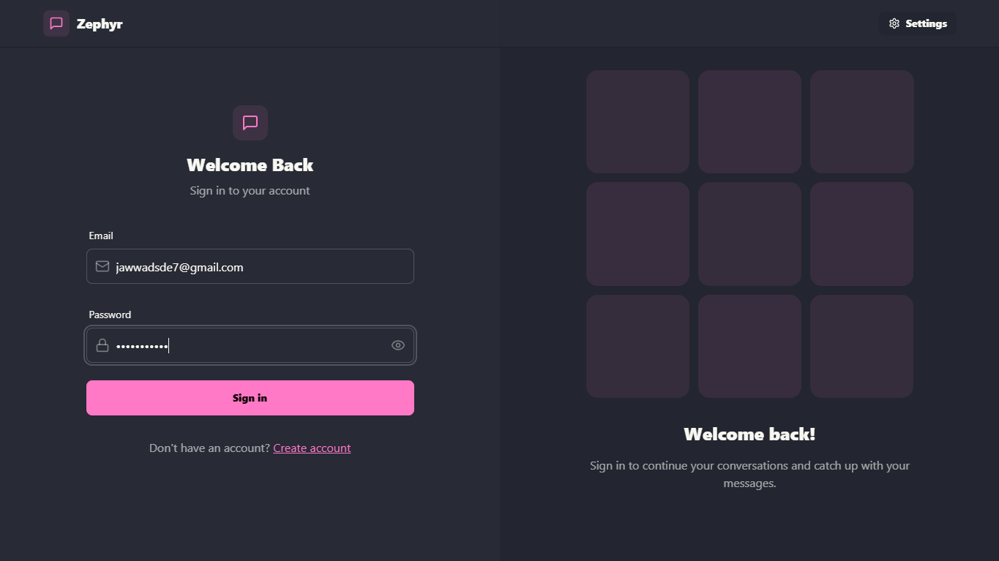

# 🌟 Zephyr Chat App  
A sleek, real-time chat application that combines modern design with powerful features, delivering a seamless communication experience.  

---

## 🚀 Features  
- **Real-Time Messaging**: Powered by Socket.io for instant conversations.  
- **Authentication & Authorization**: Secure JWT implementation.  
- **Online User Status**: Stay updated with who's online.  
- **Global State Management**: Simplified with Zustand.  
- **Error Handling**: Robust error management on both client and server.  
- **Theme Customization**: Choose from **32 stunning themes** with Daisy UI.  

---

## 🌐 Live Demo  
Check out the live application: **[Zephyr Chat App](https://zephyr-chat-app.onrender.com)**  

---

## 📸 Screenshots  

### 💬 Chat Interface  


### 🔑 Login Page  


### 🎨 Theme Selector  


### 👩‍💻 Profile 


---

## 💻 Tech Stack  
- **Frontend**: React, TailwindCSS, Daisy UI  
- **Backend**: Node.js, Express  
- **Database**: MongoDB  
- **Real-Time**: Socket.io  
- **State Management**: Zustand  

---

# 🛠️ Installation  

## 1. Clone the repository:  
```bash
git clone https://github.com/MohammedJawwad/Zephyr-Chat-App.git
cd Zephyr-Chat-App
```
## 2. Install dependencies:
### For backend
```bash
cd backend
npm install
```
### For frontend
```bash
cd ../frontend
npm install
```
## 3. Start the application:
### Start backend
```bash
cd backend
npm start
```
### Start frontend
```bash
cd ../frontend
npm run dev
```
## 4. Access the app at http://localhost:3000.
